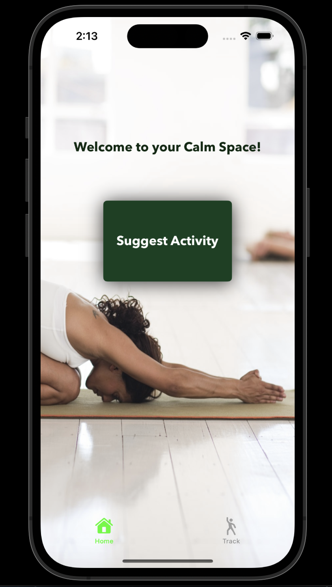
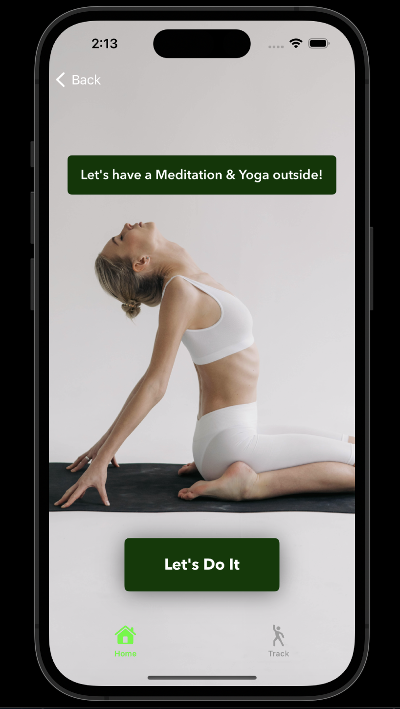
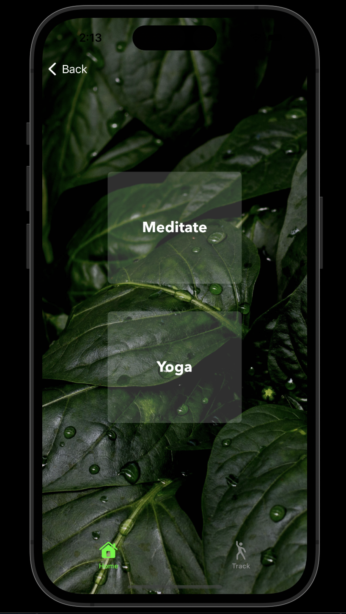
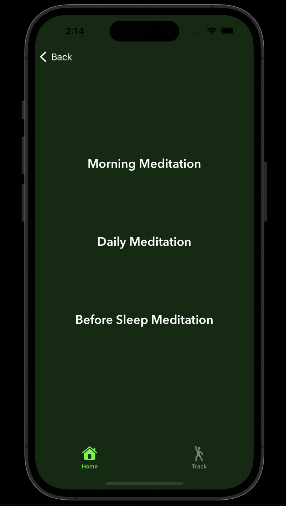
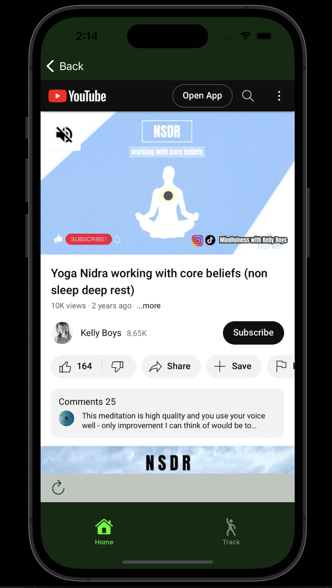
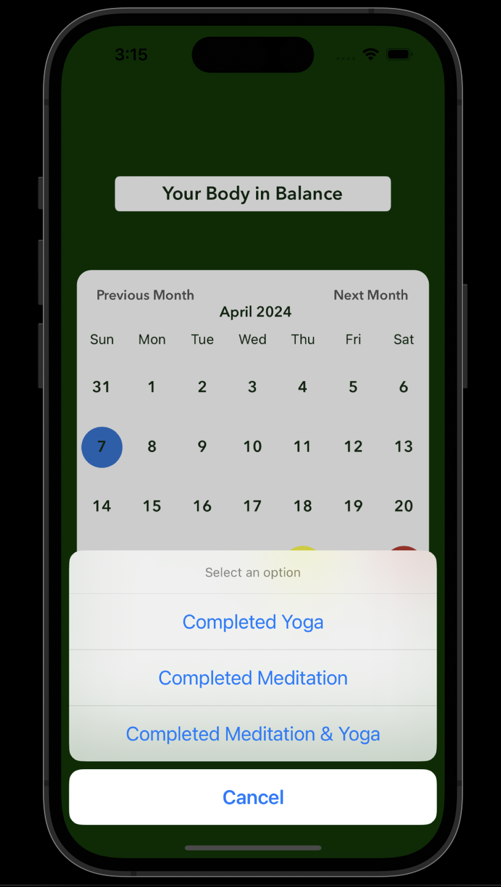

# Meditation & Yoga app

A sample project that demonstrates a usage of Swift language.

**The goal** of this app - provide a user:
* Meditation or Yoga practice with a Customized recommendation
* Display an Open Source Material for performing it
* Track the Progress
  
For holding data and utilizing the features were used: **JSON file** and **Cocoa Pods**.

An app includes both Unit and UI Tests.

**Swift language concepts** used in this project include but are not limited to: 
* Enums and Structs
* Custom Methods and Error Handling
* Optional Binding
* Complex Control Flow
* Pattern Matching
* Closure-Based Actions
* JSON Decoding

**Some examples of an app screens:**

#### The first View a user sees 

#### After answering several questions intended to determine a perfect practice - the Advice Screen appears

#### After a user is ready to act - 'Let's Do It' button pressed - a Screen with Practice Choice displayed

#### When a user decides on a practice - the Screen with several relevant sections will appear 

#### The next Screen will show the last choice to make, after that - the Practice starts

#### It's also possible to track the Progress 

#### Thanks for checking my Project -  Don't hesitate to Run it!

